# 🚀 TaskSpace – AI-Powered Google Workspace Productivity Companion

> **TaskSpace** transforms Google Workspace into an intelligent productivity companion that helps users plan, prioritize, and complete work before deadlines are missed.


---

# 📖 Overview

TaskSpace is an AI-powered productivity platform built for the **Vibe2Ship Hackathon – Problem Statement 1: The Last-Minute Life Saver**.

Instead of acting as another reminder application, TaskSpace combines Google Workspace services with AI assistance to help users organize, schedule, collaborate, and execute work efficiently.

---

# ✨ Core Features

- Google Sign-In
- Smart Task Management
- Kanban Board
- Google Calendar Integration
- Google Tasks Synchronization
- Gmail Draft Generation
- Google Docs Generation
- Google Sheets Generation
- Google Slides Generation
- Google Forms Generation
- Google Classroom Integration
- Google Meet Integration
- Gemini AI Assistant
- Responsive Dashboard
- Settings & Preferences

---

# 🏗️ High Level Architecture

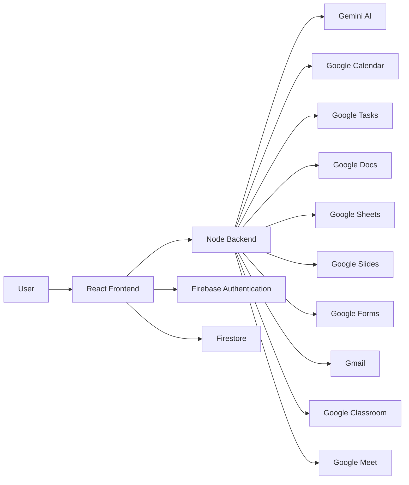

---

# 🔄 Application Flow

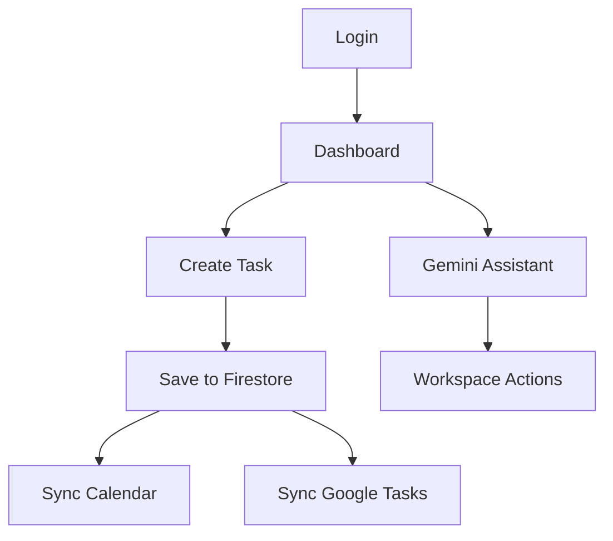

---

# 🤖 AI Workflow

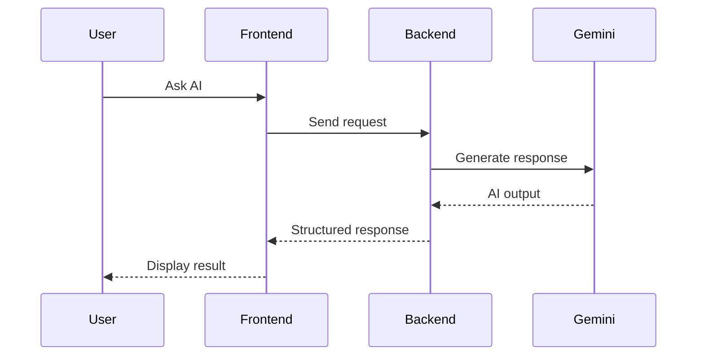

---

# ☁️ Google Workspace Integration

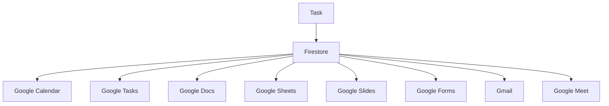

---

# 🛠️ Technology Stack

| Layer | Technology |
|------|------------|
| Frontend | React, TypeScript, Vite |
| Backend | Node.js |
| Authentication | Firebase Authentication |
| Database | Firestore |
| AI | Gemini |
| Cloud | Google Cloud |
| Styling | Tailwind CSS |
| APIs | Google Workspace APIs |

---

# 📂 Project Structure

```text
src/
├── components/
├── hooks/
├── lib/
├── assets/
├── App.tsx
└── main.tsx

server.ts
```

---

# ⚙️ Installation

```bash
git clone https://github.com/joshuaxavierthomas/taskspace.git
cd taskspace
npm install
npm run dev
```

# 🔐 Environment Variables

```env
GEMINI_API_KEY=
FIREBASE_API_KEY=
FIREBASE_AUTH_DOMAIN=
FIREBASE_PROJECT_ID=
GOOGLE_CLIENT_ID=
GOOGLE_CLIENT_SECRET=
```

---

# 🚀 Deployment

Deploy frontend and backend to Google Cloud.

Ensure Google APIs are enabled and environment variables are configured.

---

# 🛣️ Roadmap

- Deadline Risk Prediction
- Productivity Analytics
- Calendar Health
- WhatsApp Alerts
- Push Notifications
- Mobile App

---

# 📸 Application Screenshots

> **Note:** Place all screenshots inside `docs/images/` in your GitHub repository and update the image paths if necessary.

## 🔐 Login

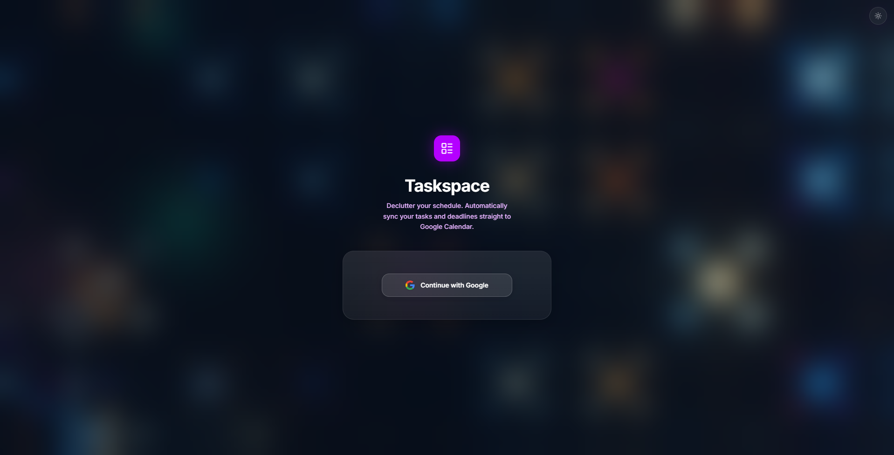

---

## 🏠 Welcome Dashboard

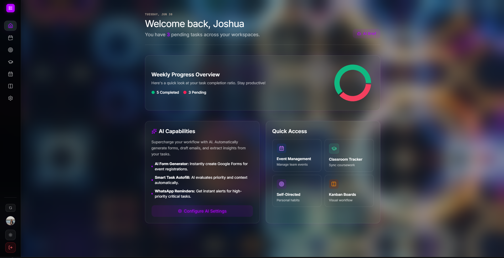

---

## 🤖 AI Brief

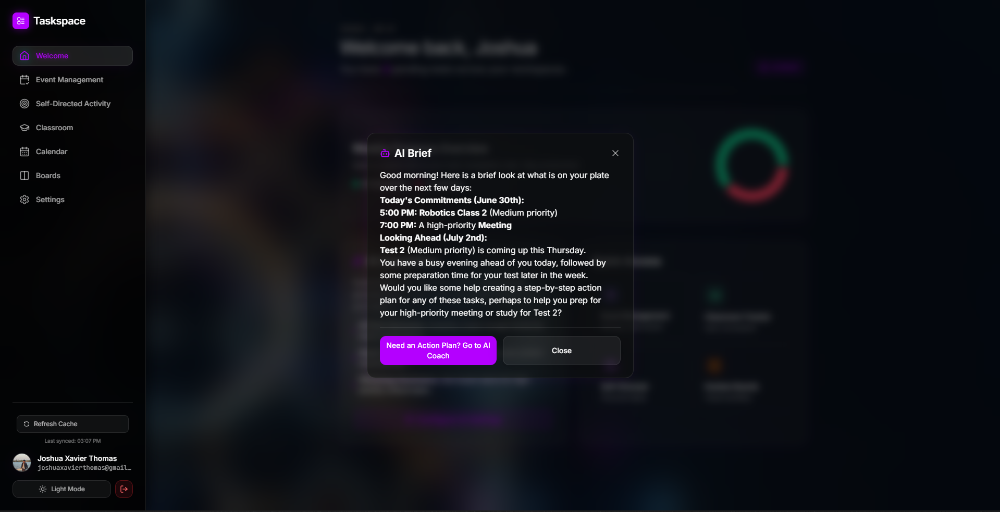

---

## 📅 Event Management

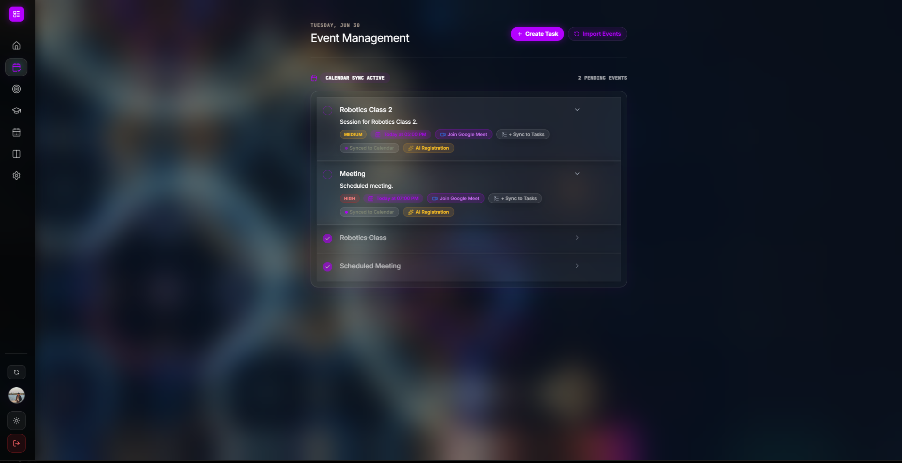

---

## ➕ Create Task / Meeting

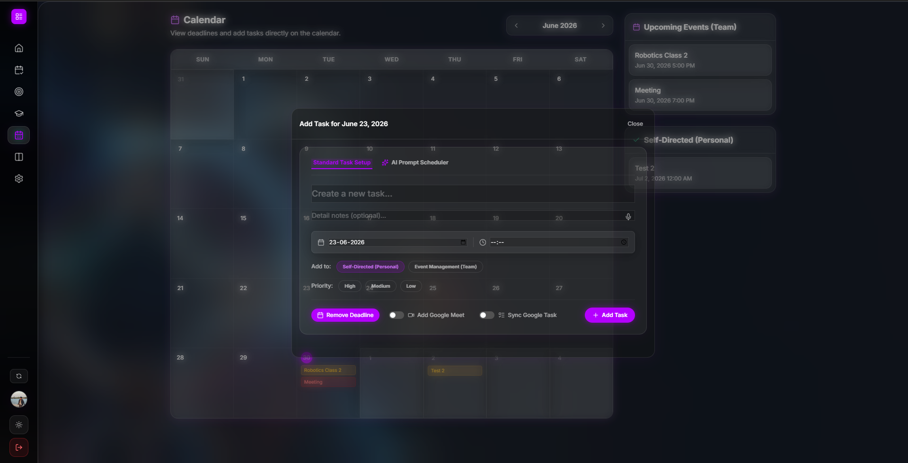

---

## 🗓️ Calendar Dashboard

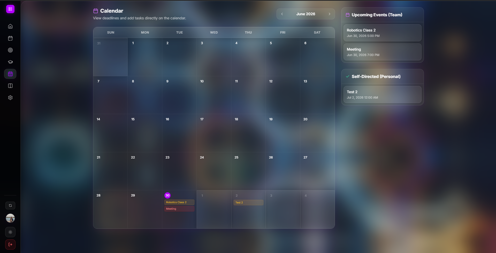

### Add Task Directly from Calendar


### Calendar Event Details

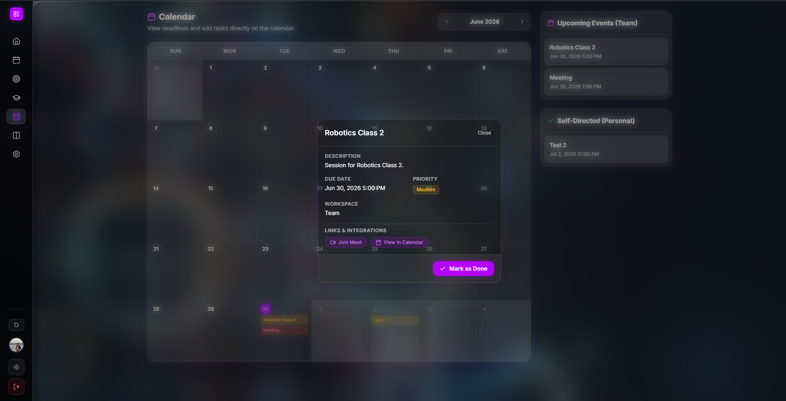

---

## 🎯 Self-Directed Activity

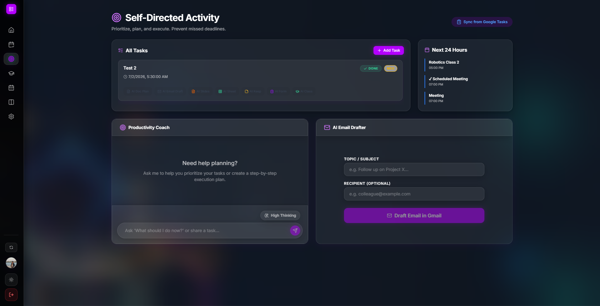

---

## 📋 Kanban Board

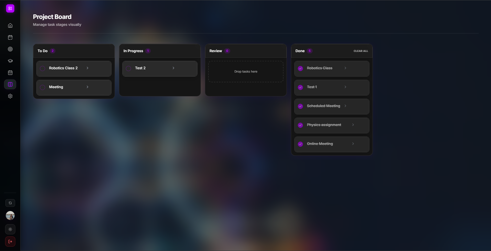

---

## 🎓 Google Classroom

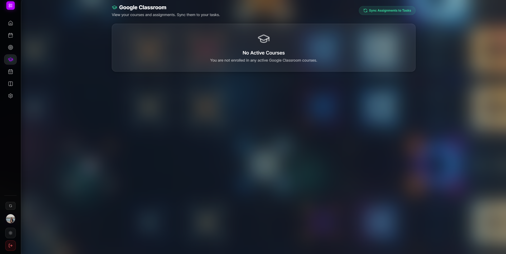

---

## ⚙️ Settings

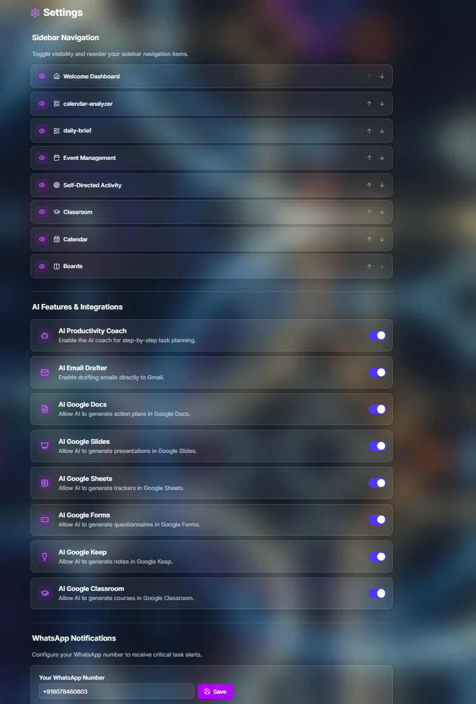

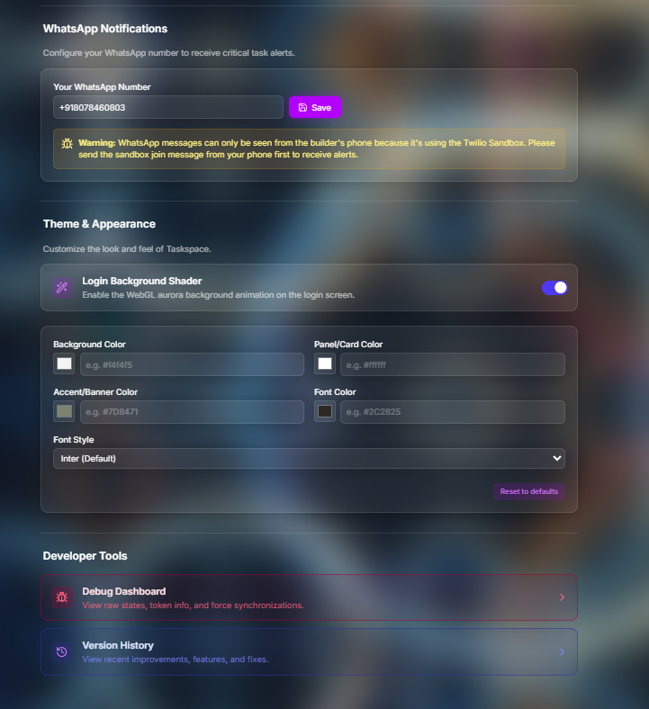

---

## 🧰 Developer Tools

### Version History

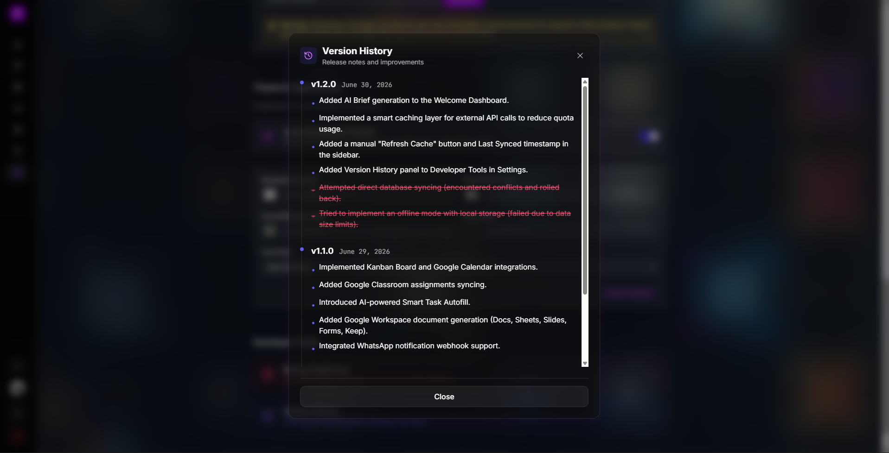

### Debug Dashboard

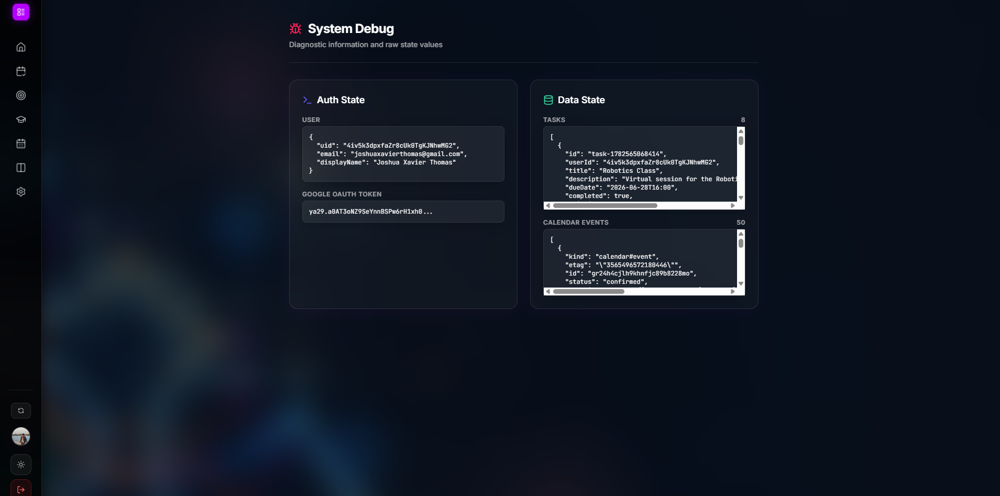

---

## 📑 Sidebar Navigation

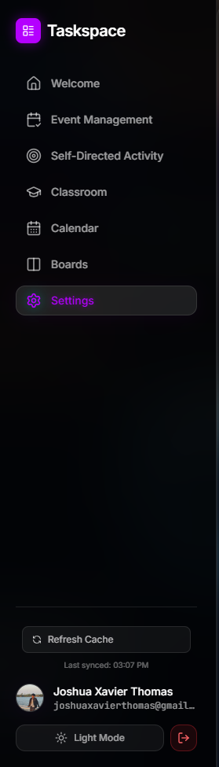

---

# 🚀 What's Next for TaskSpace

- **WhatsApp Integration:** One of our most exciting future plans is to bring TaskSpace directly into WhatsApp. Instead of requiring users to open the web application, they will be able to manage their productivity directly from a WhatsApp conversation.
- **Offline Mode & PWA Support:** Implementing IndexedDB caching and service workers so users can manage their schedules completely offline, with an offline sync queue that pushes changes to Google Workspace endpoints seamlessly the moment internet connection is restored.
- **Advanced AI Task Sub-division:** Upgrading the server-side Gemini prompts to automatically dissect large, complex goals into hierarchical, nested sub-task trees, displaying them in an indented accordion list view.
- **Team Collaboration & Delegation:** Modifying Firestore rules and schema definitions to support a `sharedWith` array, allowing users to safely delegate tasks to team members while automatically managing Google Drive document sharing permissions across separate workspaces.
- **Predictive Deadline Risk & Health Scoring:** Developing predictive analytics to compute a user's calendar health score based on task completion velocity and historical burn-down charts.

---

# 🧗 Challenges Faced

- **Google OAuth Scope Management:** Orchestrating access to over 10 different Google Workspace APIs required meticulous management of OAuth scopes and access tokens via Firebase Authentication to securely execute actions on behalf of the user.
- **Controlling the LLM Engine:** Forcing an AI to act as a strict decision engine rather than a conversational chatbot required intense prompt engineering and reliance on AI Studio's JSON schema enforcement to ensure predictable data objects that wouldn't crash the frontend application logic.
- **Rapid API Quota Exhaustion:** As we experimented with proactive agentic features, frequent model calls threatened to exhaust our available API credits. We redesigned our system architecture to handle scheduling and priority sorting via deterministic application logic locally, while reserving Gemini models strictly for tasks requiring natural language generation and reasoning. We also introduced aggressive caching layers to minimize repeated AI requests.
- **Real-time State Synchronization:** Keeping the visual Kanban board, the Calendar view, and underlying Google endpoints fully synchronized without hitting rate limits required building robust Cloud Firestore listeners and implementing optimistic UI updates. Initial direct database syncing attempts caused conflict errors and had to be refactored into a more stable state-driven approach.

---

# 👤 Author

**Joshua Xavier Thomas** ([joshuaxavierthomas@gmail.com](mailto:joshuaxavierthomas@gmail.com))
