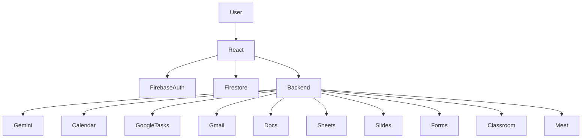
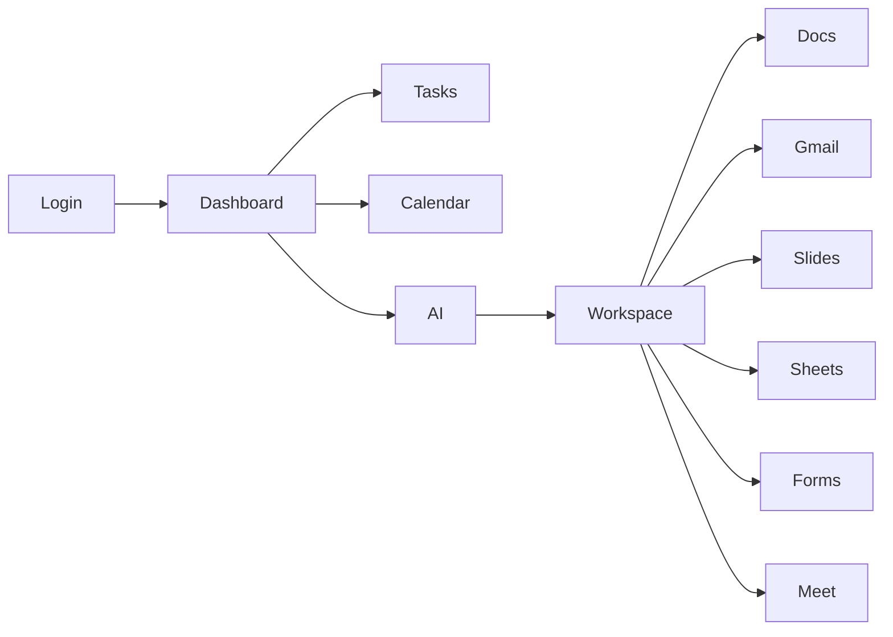
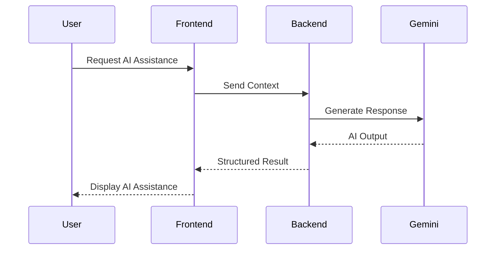

# 🚀 TaskSpace – AI-Powered Google Workspace Productivity Companion

> **TaskSpace** is an AI-powered productivity companion built for the **Vibe2Ship Hackathon – Problem Statement 1: The Last-Minute Life Saver**.
>
> Instead of acting as a simple to-do list, TaskSpace helps users **plan, prioritize, organize, and complete work before deadlines are missed** through Google Workspace integration and AI assistance.

---

## ✨ Features

- 🔐 Google Authentication (Firebase)
- ✅ Smart Task Management
- 📅 Google Calendar Integration
- ☑️ Google Tasks Sync
- 📧 Gmail Draft Generation
- 📄 Google Docs Generation
- 📊 Google Sheets Generation
- 📽️ Google Slides Generation
- 📋 Google Forms Generation
- 🎓 Google Classroom Integration
- 🎥 Google Meet Integration
- 🤖 Gemini-powered productivity assistance
- 📌 Kanban Board
- 📆 Calendar Dashboard
- ⚙️ Settings & Preferences

---

# Problem Statement

Modern productivity tools rely heavily on passive reminders that are easy to ignore. TaskSpace helps users organize work across Google Workspace and provides AI-assisted productivity features to reduce the chances of missing important deadlines.

---

# System Architecture



---

# Application Workflow



---

# Google Workspace Flow

```mermaid
flowchart TD

Task

-->

Firestore

-->

Google Calendar

-->

Google Tasks

-->

Workspace Services

-->

Docs

-->

Sheets

-->

Slides

-->

Forms

-->

Meet

-->

Gmail
```

---

# AI Workflow



---

# Technology Stack

| Category | Technology |
|-----------|------------|
| Frontend | React + TypeScript + Vite |
| Backend | Node.js |
| Database | Firestore |
| Authentication | Firebase Authentication |
| AI | Google Gemini |
| Cloud | Google Cloud |
| Styling | Tailwind CSS |
| Animation | Motion |
| APIs | Google Workspace APIs |

---

# Project Structure

```text
src/
├── components/
├── hooks/
├── lib/
├── App.tsx
├── main.tsx

server.ts
```

---

# Google Technologies Used

- Firebase Authentication
- Firestore
- Google Calendar API
- Google Tasks API
- Gmail API
- Google Docs API
- Google Sheets API
- Google Slides API
- Google Forms API
- Google Classroom API
- Google Meet
- Gemini API
- Google Cloud

---

# Installation

```bash
git clone <repository>

cd taskspace

npm install

npm run dev
```

---

# Environment Variables

```env
GEMINI_API_KEY=

FIREBASE_API_KEY=

FIREBASE_AUTH_DOMAIN=

FIREBASE_PROJECT_ID=

GOOGLE_CLIENT_ID=

GOOGLE_CLIENT_SECRET=
```

---

# Demo

Add screenshots:

```
docs/

login.png

dashboard.png

kanban.png

calendar.png

workspace.png

settings.png
```

---

# Roadmap

- Intelligent Deadline Risk Prediction
- Calendar Health Analysis
- Productivity Analytics
- WhatsApp Alerts
- Push Notifications
- Offline Support
- Mobile Application

---

# Contributors

Add your team members here.

---

# License

MIT License

---

## ⭐ Why TaskSpace?

TaskSpace combines Google Workspace services with AI-assisted productivity into a unified experience. It helps users manage tasks, collaborate through familiar Google tools, and streamline their workflow from planning to execution.

Built for the **Vibe2Ship Hackathon**.
